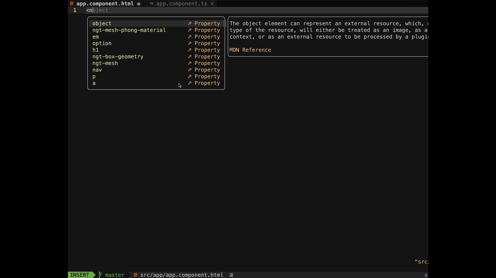

It is here 🎊, the v2 release of Angular Three. With this release, we have focused on enhancing the stability and performance of Angular Three by embracing the new [Angular Signals API](https://angular.io/guide/signals).

Additionally, we've also introduced rudimentary support for Custom Elements Typings in this release. With this addition, you can now enjoy enhanced typing support when working with Custom Elements in Angular Three.

## Introducing Signals API

The star of the show in Angular Three v2 is the Signals API. We've reworked reactivity in Angular Three by exposing everything to consumers through **Signals** instead of **Observables**. This decision brings a consistent mental model when consuming state, whether it's from Angular Three's internal state models or external 3D assets.

```ts
export class Scene {
    readonly #store = inject(NgtStore);

    // before
    readonly camera$ = this.#store.select('camera'); // Observable<NgtCamera>
    readonly glDom$ = this.#store.select('gl', 'domElement'); // Observable<HTMLElement>
    readonly controlsArgs = combineLatest([this.camera$, this.glDom$]);

    // after
    readonly #camera = this.#store.select('camera'); // Signal<NgtCamera>
    readonly #glDom = this.#store.select('gl', 'domElement'); // Signal<HTMLElement>
    readonly controlsArgs = computed(() => [this.#camera(), this.#glDom()]);
}
```

With Signals, consumers gain a unified and intuitive approach to handling state changes and events. It allows for more efficient communication between components and THREE.js objects. Plus, it sets the stage for better performance in the future, as Angular introduces enhanced change detection mechanisms.

Angular Signals API is powerful and simple enough that Angular Three does not require any 3rd-party library to help manage its internal state model. This means that there is no more dependency on `rx-angular`. Angular Signals also come with `@angular/core/rxjs-interop` package to ensure the interoperability with current reactivity model via **Observables**.

It's important to note that Signals **require** Angular 16, which becomes the **minimum supported version** for Angular Three v2. We encourage you to upgrade to Angular 16 to leverage the full power of Signals and unlock a world of reactivity possibilities.

### Custom Elements Typings Support

In response to your feedback, we're delighted to announce the introduction of _rudimentary_ Custom Elements Typings support in Angular Three v2. We've leveraged the capabilities of modern editors and IDEs to enhance the developer experience when working with Custom Elements.



Now, consumers can enjoy improved typing support, enhanced code hinting, and a smoother development workflow when interacting with Angular Three custom elements.

### Streamlined Monorepo for Easy Maintainability

Starting from version 2, all Angular Three packages are now unified under the same monorepo. This change aims to simplify the maintenance process and provide better organization for our packages. With a streamlined monorepo, we can ensure consistency across Angular Three packages and deliver updates more efficiently.

This unified approach fosters collaboration, enables faster bug fixes, and ensures a more cohesive ecosystem for Angular Three developers. We believe it's a step forward in providing a top-notch development experience for the Angular and THREE.js community.

### Embrace Angular Three v2 Today!

Angular Three v2 is here, and it's ready to take your Angular and THREE.js integration to the next level. The Signals API introduces a powerful reactivity paradigm, while the Custom Elements Typings support enhances your developer experience. The consolidated monorepo ensures better maintainability and delivers updates seamlessly. Happy coding!
